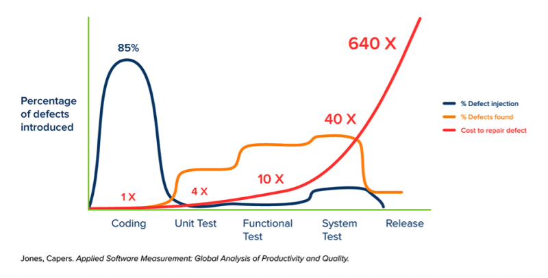
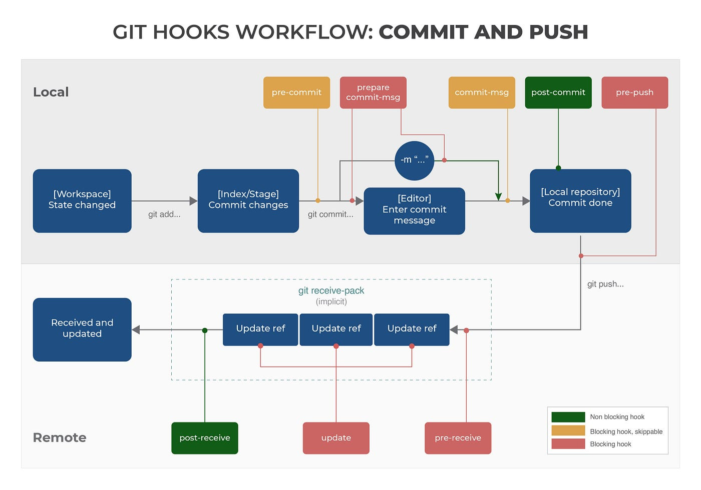
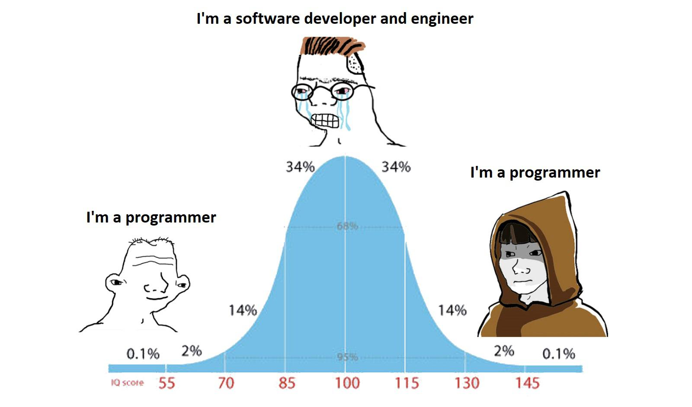

# Presentation


## whoami

Bonjour je m'appelle Simon Harvey.  Je travaille présentement chez Desjardins dans l'équipe de Sécurité Applicative (aka AppSec).  Précédemment, j'étais plutôt dans l'industrie aérospatiale chez Pratt & Whitney Canada ainsi que Bombardier Aéronautique.

Aujourd'hui, je suis ici avec vous pour vous parler de DevSecOps, plus précisément comment on peut encourager les développeurs à s'engager dans un mindset shift-left via l'utilisation de pre-commit hooks.  Je ne suis pas ici pour vous vendre un outil mais plutôt partager des idées qui pourraient aider vos pratiques de développement.

## Introduction

> Vaut mieux prévenir que guérir

Il est plus sage de prendre des mesures pour éviter un problème que d'attendre qu'il survienne pour essayer de le résoudre.  C'est essentiellement le concept des pre-commit hooks.  En utilisant des pre-commit hooks, on active le shift-left en prévenant l'ajout de code possiblement problématique à l'historique `git`.



Ce graphique provenant de [Applied Software Measurement: Global Analysis of Productivity and Quality](https://www.accessengineeringlibrary.com/binary/mheaeworks/829ef30c60b20d92/96af26c048a067d5d3bec53ac2b2c7ddc143c27fbf02f78bc72c6894d93f431a/book-summary.pdf) démontre les coûts associés à l'introduction des défectuosités et où ses introductions se produisent.

Dès lors, l'idée du **shift-left** c'est de déplacer les capacités de détection "vers la gauche" plus près d'où ces défectuosités sont créées et introduites dans le code.

### Objectifs

On demande aux développeurs soudainement d'inclure de nouveaux outils et pratiques dans leur flux de travail :

- [ ] Oublie pas d'exécuter les tests unitaires localement
- [ ] Fais un balayage de tes commits pour des fuites de secrets
- [ ] SVP lint le code selon nos obscures conventions
- [ ] Nouvelle politique que les CI actions doivent être `SHA pinned`
- [ ] Et tout le reste qu'on veut bien inventer

Ces ajouts créent une charge mentale supplémentaire pour les développeurs.  Ceux-ci doivent maintenant considérer une checklist et une multitude de nouvelles tâches à faire mécaniquement.  Cette charge mentale accrue en plus de la complexité inhérente à leur travail rend l'acceptation du shift-left difficile.  Les devs ne sont pas paresseux et il faut les outiller avec des automatisations.

### pyquiz

Pour la présentation, j'ai décidé de bâtir une petite application simple en `python`.  Cette application est un petit quiz dans un terminal.  Le but c'est que plutôt d'observer passivement une présentation, je vous propose une démarche étape par étape.

Bien sûr, qu'aujourd'hui je présente des outils et une approche, l'utilisation de celle-ci reste à contextualiser selon vos besoins et votre réalité.  C'est aussi un peu comme les shows de cuisine, tout est préparé backstage.

## git

On estime qu'environ 83% des développeurs utilisent le système `git` comme gestionnaire de version du code.  Dans sa sagesse infinie, Linus Torvalds a su inclure les fonctionnalités de `git hook` dès la première version de `git` en 2005.  À l'époque les `git hook` étaient des agents d'intégration continue (CI) minimalistes.

Les `git hooks` sont des points dans le cycle de vie du processus `git` qui avant ou après des actions permettent l'exécution de scripts.



Il existe deux types de `git hooks` :

- Server-side : S'exécute sur le serveur du gestionnaire de code **DANGER**
- Client-side : S'exécute sur le poste du développeur après activation... Le vif du sujet aujourd'hui.

### `cd .git/hooks`

Regardons le fonctionnement des `git hooks` natifs.  Lorsqu'on initialise un nouveau dépôt git (aka `git init`) par défaut une pléthore de `git hooks` sont inclus comme exemple.  Ceux-ci possèdent l'extension `*.sample` qui désactive leur fonctionnement initialement, il suffit d'enlever cette extension pour les activer.

Voyons de plus près comment on fabrique et utilise notre premier **hook**.

1. Notre premier **hook** utilisant `git hooks natif`...

   ```bash
   cp docs/prep/1.1/pre-commit .git/hooks
   ```

2. Évoluer du premier **hook**

   ```bash
   cp docs/prep/1.2/pre-commit .git/hooks
   ```

On voit dans notre exemple que certains de nos tests unitaires ne fonctionnent pas.  Ici nous empêchons l'ajout d'un commit supplémentaire puisque les politiques du projet imposent le succès de ceux-ci via un `git hook`.

Cet exemple est plus complexe, commence à inclure du error handling, des configurations diverses, etc... On peut donc s'imaginer que cette approche sera lourde à orchestrer si on souhaite appliquer toutes les politiques des pratiques de devs et de la sécurité applicative...

De plus, il y a un éléphant dans la pièce... Les `git hooks` natifs sont considérés comme un **objet** spécial par `git` c'est-à-dire qu'ils ne sont pas sous contrôle des révisions ce qui amène plusieurs problèmes :

- La distribution est pénible
- La gestion des versions
- Installation dans multiples dépôts

## Frameworks

Une pléthore d'outils open-source tentent de résoudre ces problèmes avec différentes approches.  Sans tous les nommer :

- **[Pre-Commit](https://pre-commit.com)** - A framework for managing and maintaining multi-language pre-commit hooks
- **[Husky](https://typicode.github.io/husky)** - Git hooks made easy
- [CaptainHook](https://github.com/captainhook-git/captainhook) - Git hooks manager for PHP developers
- [Git Build Hook Maven Plugin](https://github.com/rudikershaw/git-build-hook) - Install Git hooks and config during a Maven build
- [Lefthook](https://github.com/evilmartians/lefthook) - Fast and powerful Git hooks manager for any type of projects
- [Overcommit](https://github.com/sds/overcommit) - A fully configurable and extendable git hook manager
- [Prek](https://github.com/j178/prek) - Better `pre-commit`, re-engineered in Rust
- [Simple-git-hooks](https://github.com/toplenboren/simple-git-hooks) - A simple git hooks manager for small projects

### pre-commit.com

Pour les fins de la démonstration, utilisons le framework écrit en python `Pre-Commit.com` mais tous fonctionnent sensiblement avec une méthodologie similaire avec des résultats équivalents.  L'objectif étant de créer un niveau d'abstraction entre le déploiement des `git hook` et un framework plus neutre et convivial.

1. Pour installer `Pre-Commit`...

   ```bash
   pip install pre-commit
   uv tool install pre-commit
   ```

2. Installer le framework dans le dépôt

   ```bash
   pre-commit --version
   pre-commit install --allow-missing-config
   ```

3. Configurer le fichier `pre-commit-config.yaml`

   ```bash
   cp docs/prep/2.1/not.pre-commit-config.yaml .pre-commit-config.yaml
   ```

On vient de déployer une configuration qui est facile à distribuer, versionner et qui s'installe facilement pour les utilisateurs.

### trufflehog

La fuite de secret est clairement un des enjeux les plus populaires des dernières années.  Par la nature de `git` un secret ajouté dans l'historique du gestionnaire de code qui fuit devient dangereux.  Un des `pre-commit hook` les plus pertinents à déployer touche la détection des secrets.

Pour des fins de démonstration, assumons que l'utilitaire de détection `trufflehog` est disponible pour balayer notre dépôt de code.

1. Pour installer `trufflehog`...

   ```bash
    trufflehog --version
   ```

2. Configurer le fichier `pre-commit-config.yaml`

   ```bash
   cp docs/prep/2.2/not.pre-commit-config.yaml .pre-commit-config.yaml
   ```

Maintenant à chaque commit, nous sommes en mesure de scanner le dépôt de code pour une fuite de secret directement sur le poste du développeur.  En cas de fuite, le commit est omis et la fuite est contenue localement.  Le développeur peut ainsi résoudre le problème avant de polluer l'historique `git`.

### Linting, Skipping et Pinning

La prochaine charge mentale qui touche les développeurs est souvent en lien avec les conventions de code.  L'utilisation du `pre-commit` peut décharger mentalement ceux-ci et automatiser une tâche plutôt répétitive en action automagique.

1. Configurer le fichier `pre-commit-config.yaml`

   ```bash
   cp docs/prep/2.3/not.pre-commit-config.yaml .pre-commit-config.yaml &&
   cp -r docs/prep/2.3/.config .config/
   ```

2. Exécution **ad-hoc**

   ```bash
   pre-commit run --all-files
   SKIP=trufflehog pre-commit run --all-files
   # stages: [manual]
   ```

3. Ne pas exécuter le pre-commit

   ```bash
   touch demo/3
   git add .
   git commit -m "fix: do not run pre-commit" --no-verify
   ```

## CI et Scale

Avec notre nouveau modèle de `pre-commit hooks` nous sommes en mesure d'outiller les développeurs pour réduire le volume de bugs en attrapant ceux-ci à la source même.  Il faut se rappeler que l'utilisation de `pre-commit` est vraiment un choix et non obligatoire.



L'objectif à atteindre c'est la qualité du code et non d'exécuter des `pre-commit hooks`.  Pour certains les manœuvres sont une deuxième nature, pour d'autres la raison pourquoi on demande cette qualité n'est pas pertinente...  Et il y a tout le monde entre les deux.

Comment peut-on s'assurer que la qualité est atteinte ? On réplique les actions des `pre-commit hooks` dans le CI pipeline et on documente :

- [`CONTRIBUTING.md`](./prep/3.1/CONTRIBUTING.md)
- [`PULL_REQUEST_TEMPLATE.md`](./prep/3.1/PULL_REQUEST_TEMPLATE.md)
- [GH Action](./prep/3.1/.github/worklfows/pr.yml)

Maintenant si un dev oublie ou décide de ne pas exécuter le framework de `pre-commit` localement sur sa machine avant de pousser son code.  Le CI pipeline échoue et lorsqu'on fait notre **code review**, la première question devrait être... Pourquoi as-tu skippé tes `pre-commit`.  Il peut avoir d'excellentes raisons :

- Une situation **break the glass**
- Contester certaines configurations relatives aux `pre-commit`
- Et plusieurs autres... Mais une discussion s'ouvre...

Finalement, le `pre-commit` en mode CI devrait se faire de manière réfléchie.  Possiblement que certaines tâches ont avantage à être exécutées via des **actions** et scripts plus complexes et complets.

## Considérations

Il y a plusieurs considérations lors de la mise en place d'une pratique de `pre-commit` dans une organisation

- Sécurité
  - Êtes-vous prêt à exécuter des scripts arbitraires sur vos codes sources ?
  - Traiter les `pre-commits hooks` comme les dépendances logicielles (proxy, hosting interne, audit pré-adoption, etc...)
- Performance
  - Êtes-vous prêt à **perdre** 5-10sec à chaque `git commit` ?
  - Réduire l'empreinte des hooks au minimum (sécurité, formatage), utiliser les `stage: manual` ou un framework plus performant (`prek`).
- Irritation
  - Êtes-vous prêt à irriter les devs à chaque `git commit` ?
  - Commencer à petits pas, l'embarquement de cette méthodologie prendra un peu de temps et surtout la rendre facultative.

---

## Q&A
